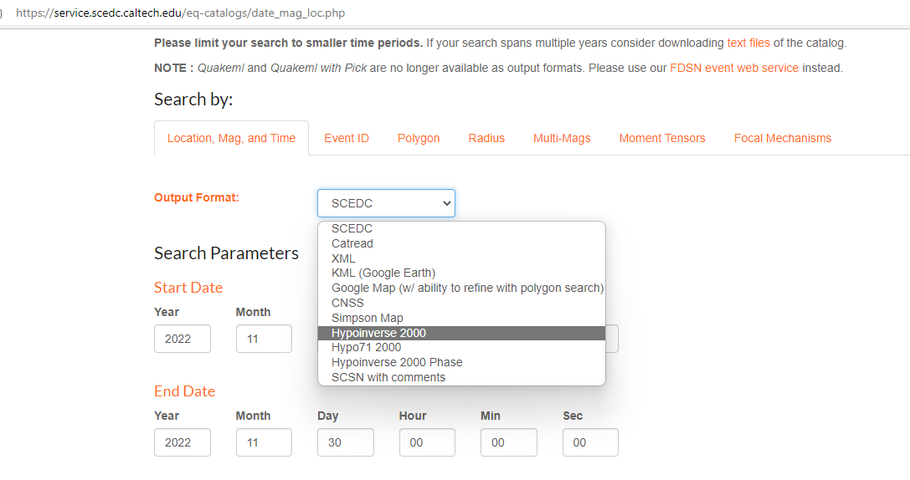
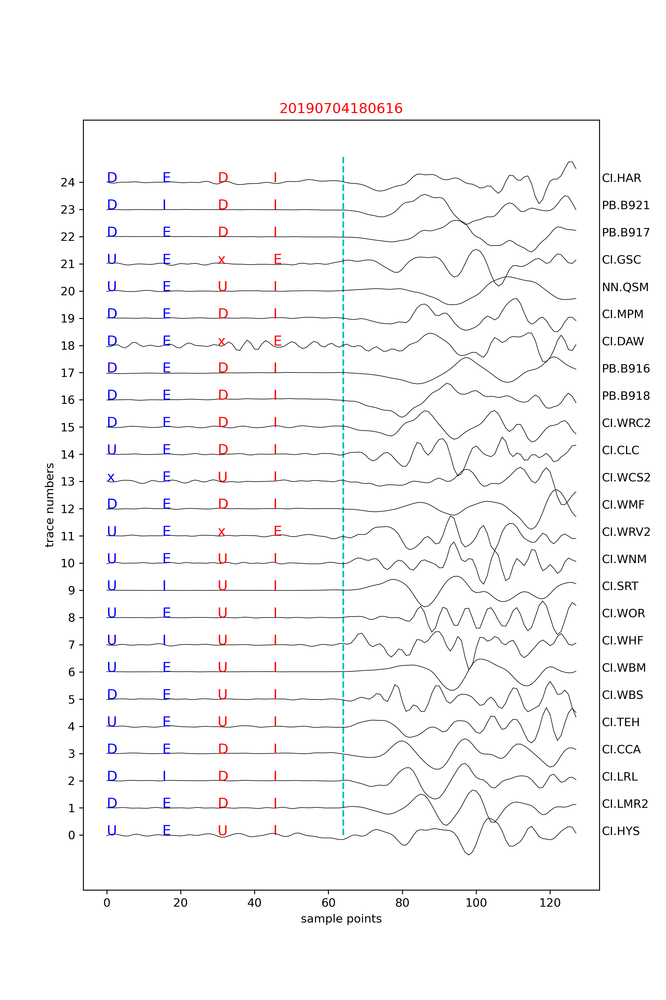
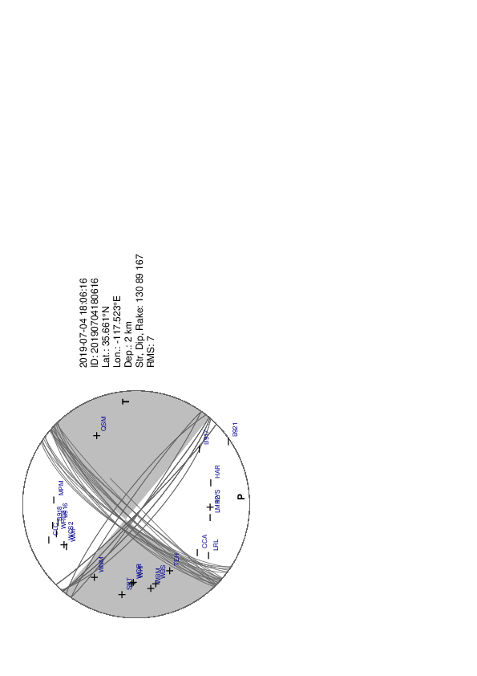

# DiTing-FOCALFLOW
Earthquake Focal Mechanism Workflow

============= 

## DiTing-FOCALFLOW is a workflow to automatically obtain focal mechanisms from seismic data  
first we use "DiTingMotion",a deep-learning-based method, to determine the P wave Fisrt Motion Polarities(FMP) automatically,then we use HASH method to invert the FMP focal mechnism. The "DiTingMotion" was trained with the P-wave FMP labels from the "DiTing"  (Zhao et al., 2022) and SCSN-FMP datasets(Ross et al., 2018), and it achieved ~97.8% accuracy on both datasets. The model maintains ~83% accuracy on data labeled as “Emergent”, of which the FMP labels are challenging to identify for seismic analysts.

The DiTingMotion confusion matrix on the test set of DiTing (left,96153 samples), SCSN-FMP (middle,2.35 M samples), and 3934 samples with “E” clarity from the DiTing dataset (right)

============= 

We use the 4 July 2019 Ridgecrest earthquake sequence in southern California as a case study.Here we teach step by step,from the origin data download to the final focal mechnism bench ball results.Users should have some background knowledge of python and anaconda.

### first step: download 4 July 2019's continous waveform using obspy fsdn services ,approximatly 38 stations' data will be downloaded.
python  1_get_waveforms.py

### second step: convert mseed data to sac data
python 2_mseed2sac.py

### third step: convert the hyperinverse 2000 format phase file( downloaded from https://service.scedc.caltech.edu/eq-catalogs/date_mag_loc.php) to the format we want to run Hash,and cut the P and S waveforms from each stations according to each events.

python 3_convert_hyperinverse_to_hash_phase.py 

### fourth step: using the well-trained models/DiTingMotionJul.hdf5 to identify FMP automatically,based on the P arrival times and cut waveforms from the third step
python 4_DiTingMotion_on_ridgecrest.py

### fifth step: convert the station info file to the format suitable for Hash
python 5_convert_to_hashpy_station.py

### six step: after the above steps we have cutted waveforms (for the calculation of S/P ampulitude ratio),the FMPs,the event location and station location, and with the given 1-D velocity model(./ca.forhash) from Shelly, D. R. (2020) ,we can perform focal mechanism inversion in batches using the script below:
python 6_runhash.py

Note that this script was modified from HASHpy2 (see references below). You probably need to compile the folder (./hash) and generate the command "hash_hashpy1D" on your own machine:

cd hash

make

cp hash_hashpy1D ..

and,you probably need to change those parameters for Hash (not necessary in this case) in the 6_runhash.py script (line 183~191).

### Final result:

============= 

## Announcements:

Users are free to make modifications to the programs to meet their particular needs, but are discouraged from distributing modified code to others without notification of the authors. If you find any part of the workflow useful, please cite our work or the corresponding publications of the packages.

Dr. Xiao zhuowei designed and trained the DiTingMotion model,Dr. Zhang Miao provided the data download and preprocessing scripts,Zhao Yanna helped on obtaining and using the HASHpy2 code.
Questions and comments? Email Ming Zhao (mn244224@dal.ca)                                                                      

## References:

### HASH:  
Hardebeck, Jeanne L. and Peter M. Shearer, A new method for determining first- motion focal mechanisms, Bulletin of the Seismological Society of America, 92, 2264-2276, 2002.

Hardebeck, Jeanne L. and Peter M. Shearer, Using S/P Amplitude Ratios to Constrain the Focal Mechanisms of Small Earthquakes, Bulletin of the Seismological Society of America, 93, 2434-2444, 2003.

### HASHPY2:
https://github.com/wsja/HASHpy2

### DiTingMotion:  
Zhao, M., Xiao, Z., Zhang, M., Yang, Y., Tang, L., & Chen, S. (2023). DiTingMotion: A deep-learning first-motion-polarity classifier and its application to focal mechanism inversion. Frontiers in Earth Science, 11, 335.https://doi.org/10.3389/feart.2023.1103914

### DiTing Dataset:
Zhao, M., Xiao, Z., Chen, S., & Fang, L. (2022). DiTing: a large-scale Chinese seismic benchmark dataset for artificial intelligence in seismology. Earthquake Science, 35, 1-11.

### SCSN Dataset:
Ross, Z. E., Meier, M. A., & Hauksson, E. (2018). P Wave Arrival Picking and First-Motion Polarity Determination With Deep Learning. Journal of Geophysical Research: Solid Earth, 123(6), 5120–5129. https://doi.org/10.1029/2017JB015251.

### CA velocty model:
Shelly, D. R. (2020).A High-Resolution Seismic Catalog for the Initial 2019 Ridgecrest Earthquake Sequence: Foreshocks, Aftershocks, and Faulting Complexity, Seismol. Res. Lett.91, 1971–1978, doi: 10.1785/0220190309.
